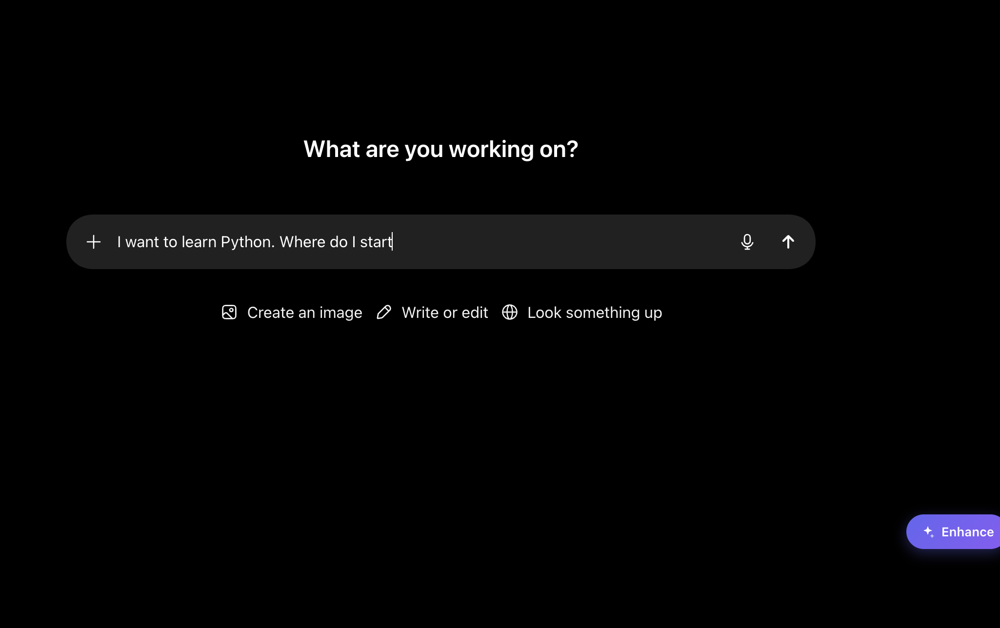
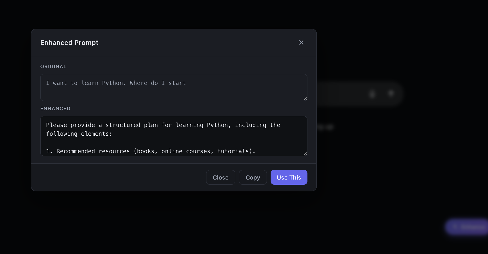
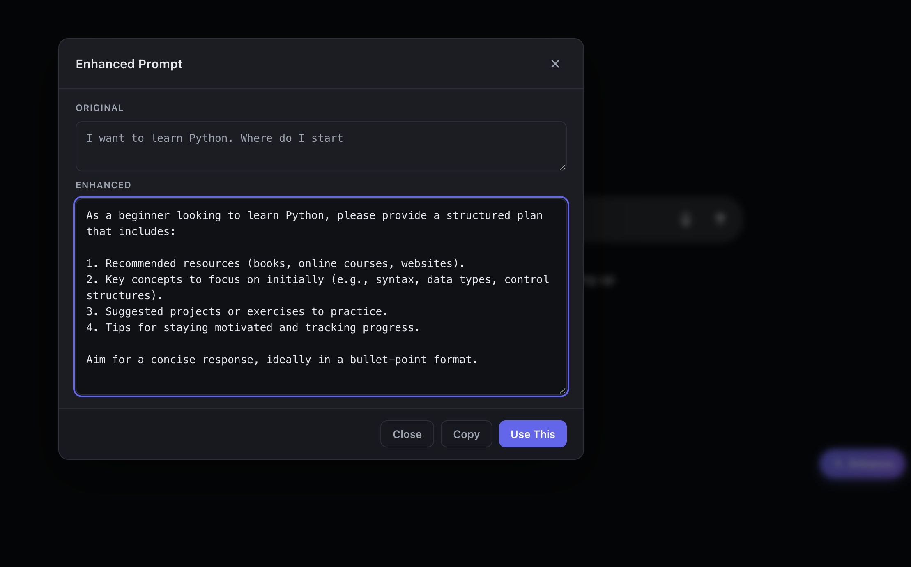
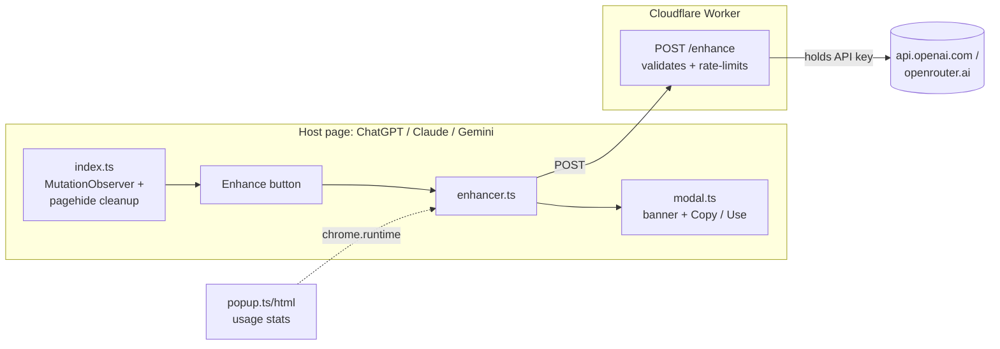

# Prompt Enhancer

[](https://github.com/YOUR-USERNAME/prompt-enhancer/actions/workflows/ci.yml)
[](./LICENSE)
[](https://developer.chrome.com/docs/extensions/mv3/intro/)

> Tired of typing **"blog post about cats"** and getting generic AI output? Click ✨ and your draft becomes a structured prompt — role, audience, format, tone — before it reaches ChatGPT, Claude, or Gemini.

Prompt Enhancer is a Manifest V3 Chrome extension that injects a small Enhance button next to the chat composer on **ChatGPT**, **Claude**, and **Gemini**. Click it, get a rewritten prompt, paste it back. Users never need to bring their own API key — calls are routed through a Cloudflare Worker proxy you control.

---

## Demo

| The button appears next to the composer | A modal shows the rewrite |
|---|---|
|  |  |

The full flow — type a rough prompt, click ✨, get back a structured one:



> _The current icons (`public/icons/*.png`) are placeholder solid-indigo squares. Replace before publishing to the Chrome Web Store._

---

## Why a proxy?

The naive approach for an extension that talks to OpenAI is to make every user paste their own API key into the popup ("BYOK"). It works, but it's friction nobody wants, and storing keys in `chrome.storage.local` is only as secure as the user's Chrome profile.

The naive _alternative_ is to bundle one shared API key into the extension. **Don't.** The extension is a zip of plain text — anyone who installs it can extract the key from `dist/content.js` in 30 seconds and drain your provider account.

The correct shape is a **proxy**: a tiny server you control that holds the API key, and the extension only knows the proxy's public URL. This repo ships that proxy as a [Cloudflare Worker](./proxy) — free tier covers ~100k requests/day, no server to maintain, deploys in a single command.

---

## Features

- One-click enhancement on ChatGPT, Claude, and Gemini
- **No API key required from end users** — the upstream key lives only on your Cloudflare Worker
- 20 requests/hour client-side rate limit; configurable per-IP ceiling on the proxy
- Retries with exponential backoff on transient failures (5xx / network / timeout)
- Focus-trapped accessible modal: Copy, Use This, Esc to close
- "Already well-written" detection — preserves good prompts instead of over-rewriting them
- Resilient to SPA navigation, fast re-renders, fast double-clicks, clipboard API failures
- No remote scripts. No analytics. CSP-strict.

---

## Cost

For personal / small-scale use this is effectively free:

- **Cloudflare Workers** — free tier covers 100k requests/day
- **OpenRouter (`openai/gpt-4o-mini`)** — pay-as-you-go, roughly **$0.0001 per enhancement** (~$1 per 10,000 calls)
- **OpenAI direct** — similar pricing

Set a spend cap on your OpenRouter / OpenAI account when you create the key so a runaway loop can't surprise you.

---

## Setup

### Prerequisites
- Node.js 18+
- An OpenAI or OpenRouter API key (held server-side, not by users)
- A Cloudflare account (free, no card required)

### 1. Deploy the proxy

The proxy holds the API key so users never need to provide one.

```bash
cd proxy
npm install
npx wrangler login                              # one-time
npx wrangler secret put OPENROUTER_API_KEY      # or OPENAI_API_KEY
npm run deploy
```

Wrangler prints a URL like `https://prompt-enhancer-proxy.<your-account-subdomain>.workers.dev`. Copy it.

### 2. Build the extension with your proxy URL

The Worker URL is injected at build time via the `PROXY_URL` environment variable — no need to edit any source files.

```bash
cd ..
npm install
PROXY_URL='https://your-worker-subdomain.workers.dev/enhance' npm run build:prod
```

If you forget to set `PROXY_URL`, the build still succeeds but defaults to a placeholder, and the extension will fail at runtime with a network error. This is deliberate — a "loud failure" so you can't accidentally publish a build pointing nowhere.

Output lands in `dist/`.

### 3. Load into Chrome

1. Open `chrome://extensions`
2. Enable **Developer mode** (top right)
3. Click **Load unpacked** → select the `dist/` folder
4. Visit ChatGPT / Claude / Gemini — the ✨ Enhance button appears next to the composer

### 4. (Optional) Lock the proxy to your published extension

Once you publish to the Chrome Web Store, copy the published extension ID into `proxy/wrangler.toml` under `ALLOWED_EXTENSION_IDS` and redeploy. The proxy will then reject requests from any other origin.

---

## Dev workflow

```bash
npm run watch       # esbuild watch mode (JS)
npm run build:css   # rebuild Tailwind output
npm run lint
npm run format
```

After any change, click the **reload** button on the extension's card in `chrome://extensions`, then refresh the AI chat tab.

---

## Architecture



<details>
<summary>Source layout</summary>

```
src/
├── content/
│   ├── index.ts          # MutationObserver, injection, orchestration
│   ├── platforms.ts      # site detection + textarea selectors
│   ├── enhancer.ts       # proxy call, retry, EnhancerError
│   └── ui/
│       ├── button.ts     # idle / loading / disabled states
│       └── modal.ts      # focus trap, Esc to close, copy fallback
├── popup/                # settings UI (usage stats only)
├── background/           # rate limiter + usage stats
├── utils/
│   ├── constants.ts      # PROXY_URL (env-injected), limits, storage keys
│   ├── storage.ts        # chrome.storage wrappers
│   ├── sanitize.ts       # validation, length checks
│   └── similarity.ts     # Jaccard analysis for "already well-written"
└── styles/
    ├── content.css       # scoped under `.pe-root`
    └── popup.css

proxy/
└── src/worker.ts         # Cloudflare Worker — rate limit + provider call
```
</details>

### Storage keys (all under `chrome.storage.local`)
- `pe_usage_ts` — timestamp array for client-side rate limiting

### Proxy

See [`proxy/README.md`](./proxy/README.md) for full Worker setup, secrets, and per-IP rate-limit configuration.

---

## Verify it works

After loading the unpacked extension:

- [ ] Popup opens and shows current usage (e.g. `0 / 20`)
- [ ] On `chatgpt.com`, the ✨ Enhance button appears near the composer
- [ ] Empty composer + click → instant "Prompt is too short." toast (no loading flicker)
- [ ] Rough draft (e.g. *"blog post about cats"*) → modal shows a rewritten prompt
- [ ] An already-structured prompt → modal shows an info banner ("already well-written")
- [ ] **Copy** writes to the clipboard and the button briefly shows "Copied!"
- [ ] **Use This** replaces the draft in the composer and closes the modal
- [ ] **Esc** closes the modal
- [ ] After 20 enhances within an hour, the next attempt shows the rate-limit toast
- [ ] Switching between chats does not duplicate the button: in DevTools console, `document.querySelectorAll('.pe-enhance-btn').length === 1`
- [ ] Repeat on `claude.ai` and `gemini.google.com`

---

## Troubleshooting

**The Enhance button doesn't appear.**
- Click the reload icon on the extension's card in `chrome://extensions`.
- Hard-refresh the host tab (`Cmd+Shift+R` / `Ctrl+Shift+R`).
- Open DevTools on the host tab and look for an exception during page load.

**Clicking Enhance does nothing.**
- Open DevTools Console on the host tab.
- The host site's UI may be overlapping the button — check the bottom-right corner of the viewport.
- If you forked the repo, confirm you built with `PROXY_URL=…` set; otherwise the placeholder URL is baked in and every request fails.

**"Could not reach the enhancer service."**
- Health-check your Worker: `curl https://your-worker.workers.dev/health` should return `{"ok":true}`.
- Verify the secret is set: `cd proxy && npx wrangler secret list` should list `OPENROUTER_API_KEY` (or `OPENAI_API_KEY`).
- Check Worker logs in real time: `cd proxy && npm run tail` then click Enhance again.

**"Hourly limit reached."**
- The extension caps you at 20 enhances per rolling hour. Open the popup and click **Reset Counter** to clear it, or wait.
- The proxy independently caps requests per IP (default 30/hr) — bump `RATE_LIMIT_PER_HOUR` in `proxy/wrangler.toml` if you need more.

**The button moves around / disappears between chats.**
- The extension uses a `MutationObserver` to track SPA re-renders. If it gets confused, the worst case is a single second of flicker. If the button never reappears, reload the extension.

---

## Security

- **The upstream API key never reaches the client.** It lives as a Wrangler secret on the Cloudflare Worker. The extension only knows the Worker's URL.
- All user input is length-validated client-side; the proxy revalidates server-side before any provider call.
- CSP forbids `eval`, inline scripts, and remote scripts.
- The only outbound host the extension contacts (besides the host AI site) is your `*.workers.dev` URL.
- Lock the proxy to your published extension ID via `ALLOWED_EXTENSION_IDS` once you publish.
- Report security issues privately — see [`SECURITY.md`](./SECURITY.md).

---

## Releasing to the Chrome Web Store

1. Deploy / update the proxy: `cd proxy && npm run deploy`
2. Bump `version` in `public/manifest.json` and `package.json`
3. `PROXY_URL='https://your-worker.workers.dev/enhance' npm run build:prod`
4. Zip the `dist/` folder
5. Upload to the [Chrome Web Store dashboard](https://chrome.google.com/webstore/devconsole) (one-time $5 developer fee)
6. Copy the published extension ID into `proxy/wrangler.toml` → `ALLOWED_EXTENSION_IDS`; redeploy the proxy

---

## Contributing

Issues and PRs welcome. Please open an issue first for anything larger than a bug fix or a typo. Run `npm run lint && npx tsc --noEmit` before pushing.

---

## License

[MIT](./LICENSE)
